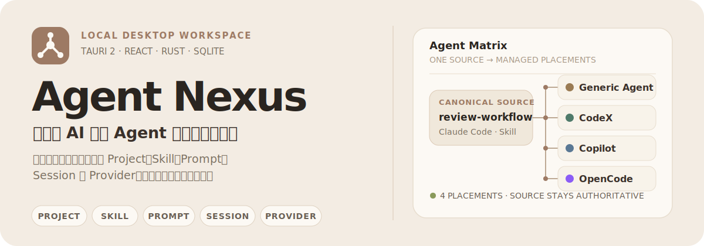
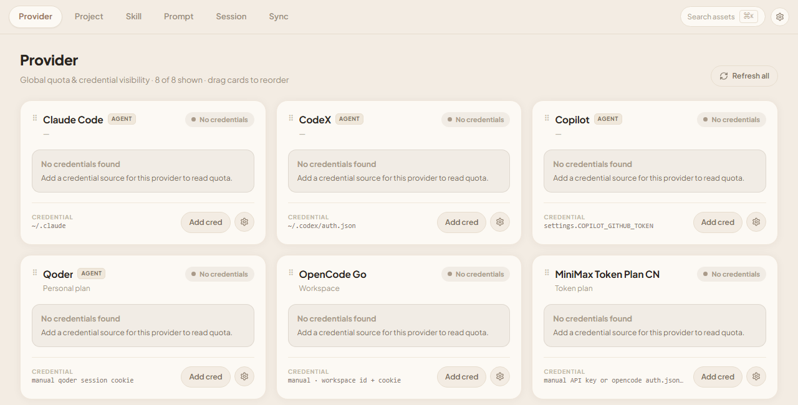

<p align="center">
  
</p>

<p align="center">
  <strong>本地优先的个人 AI 编程资产中枢</strong><br>
  <sub>当前版本 0.1.0 · 源码开发阶段</sub>
</p>

Agent Nexus 把 `Provider / Project / Skill / Prompt / Session` 组织成一层共享资产。你可以保留一个权威来源，再把需要传播的 Skill 与 Prompt 放到不同 Agent 的消费位置，而不必逐个工具维护重复副本。

<p align="center">
  
</p>
<p align="center"><sub>当前前端的 Provider 工作台预览；真实额度读取依赖桌面运行时与本地凭据。</sub></p>

## 核心能力

| 工作域 | 能做什么 |
| --- | --- |
| **Project** | 收录已有 Git 仓库；支持手动添加或从 Git Base Folder 扫描；识别路径移动与 stale 状态。 |
| **Skill & Prompt** | 扫描 Global / Project 资产；通过 Agent Matrix 管理 canonical source、target 与受管 Placement。 |
| **Session** | 按 Project 浏览、筛选和预览本地或 Cloud 会话；为每个 Project 维护系统托管的归档任务。 |
| **Provider** | 集中查看额度、凭据来源和状态；支持卡片排序、刷新设置与 Windows 任务栏额度显示。 |
| **Sync** | 用 Task Group 编排单向 Distribution、Push 与 Pull；支持 Copy、Symlink、Windows Junction、CRON 与 WebDAV。 |

### 共享，而不是复制出更多真相源

1. **Project 提供上下文**：一个 Project 对应一个已收录的 Git repository root。
2. **Canonical Source 保持权威**：Skill 与 Prompt 只有一个权威来源。
3. **Agent Matrix 建立 Placement**：目标 Agent 得到受 Agent Nexus 管理的消费位置。
4. **Sync Task 显式表达方向**：`Local → Local`、`Local → Cloud`、`Cloud → Local` 各自独立，不隐藏双向同步语义。

> 只有可传播的 Skill 与 Prompt 进入 Agent Matrix。Session 以归档和恢复为核心，Provider 只做额度与凭据可见性，Project 则提供上下文边界。

## 支持范围

当前领域模型以以下 Agent 作为主要资产消费端：

- Generic Agent
- Claude Code
- CodeX
- Copilot
- OpenCode

Provider 观测入口还包括 OpenCode Go、Qoder、MiniMax Token Plan CN、DeepSeek、OpenRouter，以及符合当前适配规则的 OpenCode custom provider。`OpenCode` 是 Agent，`OpenCode Go` 是 Provider quota 入口，二者不会被自动等同。

## 快速开始

当前仓库尚未提供可下载的安装包，请从源码运行。

### 环境要求

| 工具 | 要求 |
| --- | --- |
| [Node.js](https://nodejs.org/) | ≥ 20.19 |
| [pnpm](https://pnpm.io/) | 11.8.0（见 `packageManager`） |
| [Rust](https://rustup.rs/) | stable，通过 rustup 安装 |

macOS 还需要 Xcode Command Line Tools；Windows 需要 [Microsoft C++ Build Tools](https://visualstudio.microsoft.com/visual-cpp-build-tools/)。

### 安装并启动桌面应用

```bash
pnpm install
pnpm tauri dev
```

首次启动时 Cargo 需要编译 Rust 依赖，耗时会明显长于后续启动。Windows 下项目脚本会准备并校验 SQLite 动态链接依赖。

仅查看前端界面：

```bash
pnpm dev
```

浏览器预览默认位于 `http://localhost:3001`，不包含 Rust 后端；资产扫描、文件链接、WebDAV 与额度刷新需要完整 Tauri 运行时。

### 完成第一次资产分发

1. 在 **Project → Add Project** 中添加一个已有 Git 仓库。
2. 打开 **Skill → Refresh**，扫描现有 Skill。
3. 在 Skill 行中点击另一个 Agent 的目标图标。
4. Agent Nexus 会从 canonical source 建立受管 Placement。

这条路径要求本地已经存在一个符合约定的 Skill，例如某个 Agent skills 目录中含有 `SKILL.md` 的目录。

## 开发命令

```bash
pnpm build       # 前端构建
pnpm typecheck   # TypeScript 类型检查
pnpm rust:test   # Rust 测试；Windows 下自动准备 SQLite
pnpm rust:fmt    # Rust 格式检查
pnpm rust:lint   # Clippy，warnings 视为错误
pnpm tauri build # 构建桌面产物
```

## 架构

```text
src-react/                 React + Vite + TypeScript
    │ typed invoke
    ▼
src-tauri/                 薄 Tauri 2 壳：命令、窗口、托盘、调度
    │ service calls
    ▼
crates/nexus-core/         Rust 领域层：Project / Distribution / Sync / Provider
    ├── SQLite             本地状态
    ├── Filesystem         扫描、Copy、Symlink、Junction
    └── WebDAV             Cloud Push / Pull 与 Session 归档
```

核心领域逻辑不依赖 Tauri，可在 `nexus-core` 中独立测试。前端通过按领域划分的 typed API 与 React Query 访问后端，不在组件中维护第二份服务端状态。

详见 [Architecture Design](./docs/design/Architecture%20Design.md) 与 [Database Schema](./docs/design/Database%20Schema.md)。

## 当前边界

- 项目仍处于 `0.1.0` 开发阶段，`bundle.active` 当前为 `false`，没有正式发行安装包。
- 当前实现仅提供浅色主题；主窗口最小尺寸为 `1100 × 720`。
- 每个 Sync Task 严格遵守 `1 source → 1 target`；`Cloud → Cloud` 非法，双向效果需要两个显式反向 Task。
- Symlink 与 Junction 仅用于 `Local → Local`；Junction 仅支持 Windows。Copy 是增量复制，不等同于删除目标陈旧文件的镜像。
- Git Base Folder 只扫描直接子级，不递归发现仓库。
- Provider 功能用于额度观测和凭据来源诊断，不接管第三方账号生命周期。

## 项目结构

```text
agent-nexus/
├── src-react/             React 前端
├── src-tauri/             Tauri 桌面壳
├── crates/nexus-core/     Rust 领域与基础设施
├── docs/                  设计、ADR 与原型资料
└── scripts/               开发与 SQLite 辅助脚本
```

## 文档

- [领域模型与统一语言](./CONTEXT.md)
- [业务需求](./docs/design/Business%20Requirement.md)
- [架构设计](./docs/design/Architecture%20Design.md)
- [数据库设计](./docs/design/Database%20Schema.md)
- [架构决策记录](./docs/adr/)
- [开发注意事项](./GOTCHAS.md)
